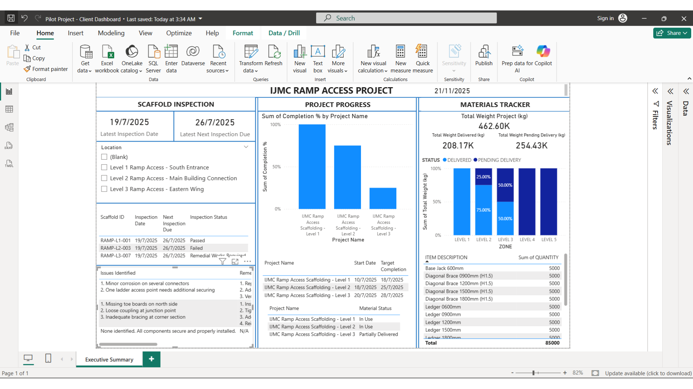
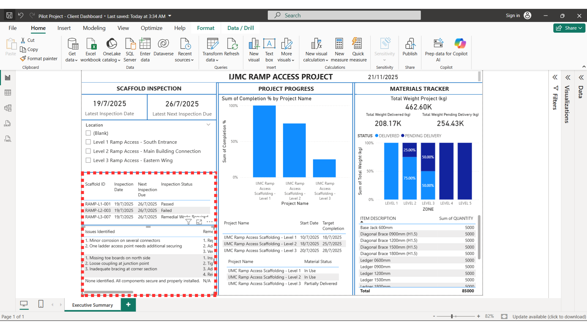
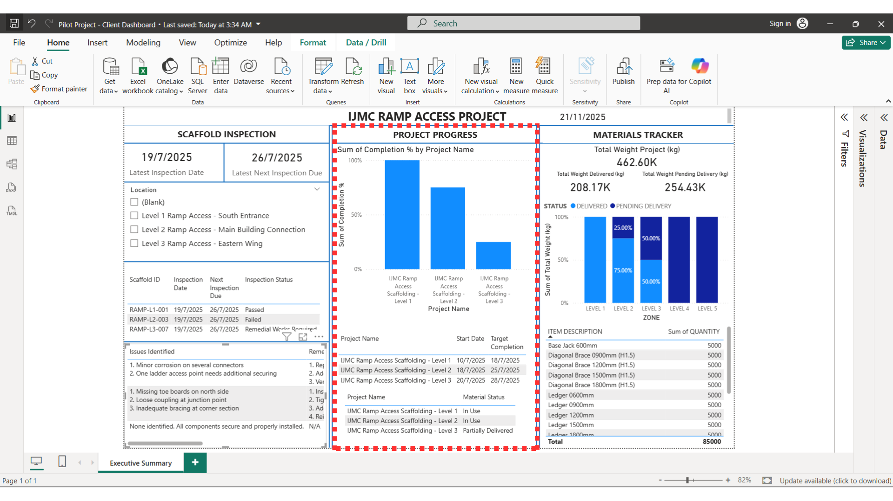
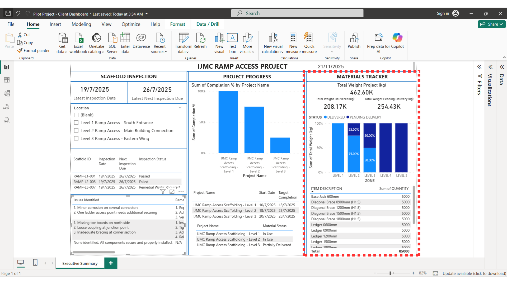

# Construction Project Dashboard: Access Scaffolding

## 📊 Executive Summary
This Power BI dashboard was developed to manage the end-to-end lifecycle of the IJMC Ramp Access scaffolding project. It serves as a central operational tool for Project Managers and Safety Officers to monitor construction progress, ensure safety compliance (Green Tag inspections), and optimize material inventory.

The dashboard consolidates data from site inspections, logistics, and construction teams into a "single-pane-of-glass" view to facilitate rapid decision-making.

## 🖼️ Dashboard Visuals & Features

### 1. Full Operational Overview

*A comprehensive view of the project status, combining safety data, physical progress, and logistics metrics on a single canvas.*

### 2. Location-Based Filtering

* **Feature:** Dynamic Location Slicing.
* **Function:** Allows site supervisors to drill down into specific project areas (e.g., "Level 2 Ramp Access - Main Building Connection"). Selecting a location automatically filters the inspection logs and progress charts to show only relevant data.

### 3. Safety & Inspection Tracking (Green Tag Status)

* **Feature:** Inspection Log & Failure Analysis.
* **Function:** Monitors the "Green Tag" status of scaffolding structures. It highlights critical safety data including:
    * Inspection dates (Last vs. Next Due).
    * Pass/Fail status for specific Scaffold IDs.
    * **Root Cause Analysis:** Detailed logging of failure reasons (e.g., "Missing toe boards," "Minor corrosion") to expedite remedial works and ensure safety compliance.

### 4. Construction Progress Monitoring

* **Feature:** Erection Progress vs. Target.
* **Function:** Visualizes the physical progress of scaffolding structure erection across different levels. This helps project managers identify which zones are behind schedule (e.g., Level 3) versus those nearing completion (e.g., Level 1).

### 5. Material Utilization & Logistics

* **Feature:** Material Inventory & Idling Monitor.
* **Function:** Tracks the efficiency of material usage on-site.
    * **KPIs:** Monitors Total Weight Delivered (208.17K kg) vs. Pending Delivery (254.43K kg).
    * **Utilization:** Analyzes material distribution by zone (Delivered vs. Pending) to prevent "material idling" (inventory sitting unused) and ensure supply chain efficiency.

## 🛠️ Key Technical Skills Applied
* **Data Modeling:** Created relationships between Site Progress, Inspection Logs, and Material Inventory tables.
* **DAX Measures:** calculated KPIs for `Total Weight Project`, `Completion %`, and Inspection status flags.
* **UI/UX Design:** Designed a clean, grid-based layout for easy readability on tablets used by site supervisors.

## 📁 File Information
* **Tool:** Power BI Desktop
* **Dataset:** Construction site operational data (Anonymized for portfolio use)
